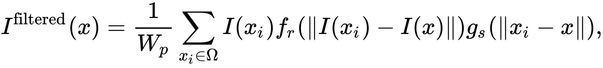
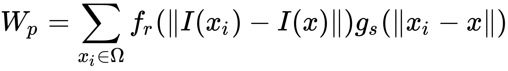
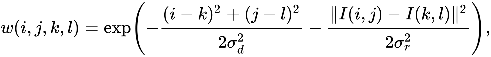
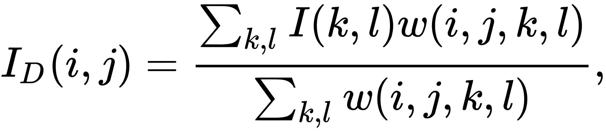

# Filtro bilaterale

Un filtro bilatrale è un filtro non-lineare, preserva i contorni e la riduzione del rumore con filtri per le immagini. Sostituisce la densità
di ogni pixel con una media pesata dell'intensità dei pixel vicini. Questi pesi possono essere basati da una distribuzione gaussiana. Crucialmente
i pesi dipendono non solo dalla distanza euclidea dei pixel (In matematica, la distanza euclidea è una distanza tra due punti, in particolare è una misura della lunghezza del segmento avente per estremi i due punti. ma anche dalle differenze radiometriche come la differenza di range, l'intensità di colore,  distanza di profondità ecc. Questo preserva i bordi

## Definizione

Il filtro bilaterale è definito come

e il termine di normalizzazione Wp è definito come 

dove
I^filtered è l'immagine filtrata
I è l'immagine di input da filtrare
x sono le coordinate del pixel corrente che deve essere filtrato
omega è la finestra centrata in x, quindi xi appartiene omega in un altro pixel
fr è il range kernel per le differenze di smoothing in intesità (questa funzione può essere una gaussiana) !scrivimeglio!!
gs è il kernel spaziale (o dominio) per la differenza di smoothing in coordinate (questa funzione può essere una gaussiana)

Il peso Wp è assegnato usando la chiusura spaziale (usando il kernel spaziale gs) e le differenze di intensità (usando il range kernel fr). Considera un pixel posizionato a (i,j) that needs to be denoised in image using its neighbouring pixels and one of its neighbouring pixels is located at (k,l). Quindi, assumendo che il range e i kernel spaziali per essere guassiani, il peso assegnato al pixel (k,l) per denoise il pixel (i,j) è dato da

dove sigma_d e sigma_r sono parametri di smoothing e I(i,j) e I(k,l) sono le intensità dei pixel (i,j) e (k,l) rispettivamente

dopo aver calcolato i pesi, normalizziamo

dove Id è il denoised intensity of pixel (i,j)

## Parametri
- All'aumentare di sigma_r (parametro di range), il filtro bilaterale assomiglia gradualmente la convoluzione gaussiana perché il range gaussiano si allarga e si appiattisce, che significa che diventa quasi costante nell'intervallo di intensità dell'immagine.
- All'aumentare del parametro spaziale sigma_d, le caratteristiche più grandi vengono levigate.

# Limitazioni
Il filtro bilaterale può introdurre varii tipi di artefatti
- effetto Staircase - altipiani di intensità che portano a immagini che appaiono come cartoni animati
- gradient reversal - introuzione di falsi bordi nell'immagine

Esistono diverse estensioni al filtro che si occupano di questi artefatti, come il filtro bilaterale in scala che utilizza un'immagine ridotta per calcolare i pesi.  Anche filtri alternativi, come il filtro guidato, sono stati proposti come un'alternativa efficiente senza queste limitazioni.

Fonte: https://en.wikipedia.org/wiki/Bilateral_filter